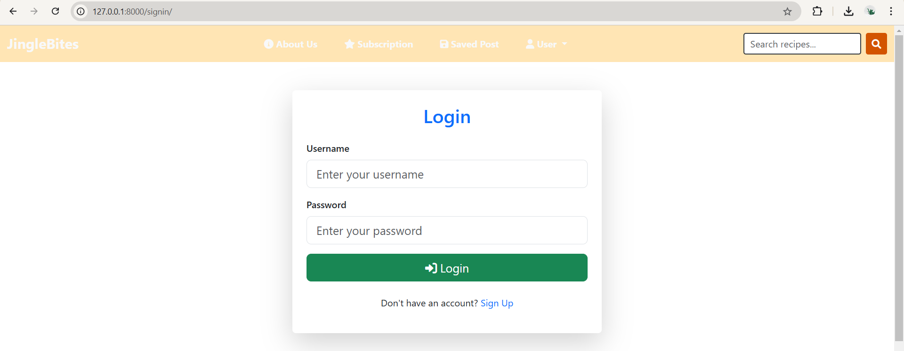

# JingleBites - Christmas Treats

JingleBites is an online recipe-sharing hub dedicated to spreading the joy of Christmas through delicious themed recipes. It enables users to share, rate, and explore festive culinary creations while offering unique features for an engaging experience.

## Features
- **User Authentication**: Login and signup functionality.
- **Author Name Creation**: Users create a pseudonym (author name) under which they post recipes, keeping their identity anonymous.
- **Subscription Plans**:
  - **Free Plan**: 1 post and 1 download per day.
  - **Basic Plan**: 3 posts and 3 downloads per day.
  - **Standard Plan**: 10 posts and 10 downloads per day.
  - **Premium Plan**: Unlimited posts and downloads.
- **Post Management**: Users can create, view, edit, and delete their recipes.
- **Interactive Features**:
  - View other users' recipes.
  - Rate and comment on others' recipes with an average rating displayed on the recipe card.
- **PDF Downloads**: Download recipes (own or others') in PDF format.
- **Meal Planner**: Save recipes for specific dates, automatically removing them after the date passes.
- **Search Functionality**: Search recipes by name or ingredients.
- **About Us Page**: Learn more about the platform and its vision.

## Technologies Used
- **Backend**: Django, Python
- **Frontend**: HTML, CSS, Bootstrap, JavaScript
- **Rich Text Editor**: CKEditor

## Installation Instructions
To set up the project locally, follow these steps:

1. Clone the repository:
   ```bash
   git clone https://github.com/username/jinglebites.git
   cd jinglebites
2. Windows:
   ```bash
   python -m venv venv
   venv\Scripts\activate
3. Windows:
   ```bash
   python manage.py makemigrations
   python manage.py migrate


## Usage Instructions 🚀  

1. **Sign up and log in** to the platform to get started.  
2. **Create your unique author name** to begin posting recipes.  
3. **Select a subscription plan** to unlock additional posts and downloads per day:  
   - Free Plan: 1 post and 1 download per day.  
   - Basic Plan: 3 posts and 3 downloads per day.  
   - Standard Plan: 10 posts and 10 downloads per day.  
   - Premium Plan: Unlimited posts and downloads.  
4. **Share your Christmas-themed recipes** and explore creations from other users.  
5. **Rate, comment, and download recipes** in PDF format for easy sharing and access.  
6. Use the **meal planner** to organize your Christmas meals. Recipes saved for a specific date will automatically be removed once the date has passed.  
7. **Search for recipes** by name or ingredients using the search bar.
8. **settings.py** add your email-id and app-password for django email confirmation.

---

## Contributors ✨  
- **Smit Rane**  

We welcome feedback and contributions to improve **JingleBites**! 🎄  

## Screenshots

1. **Homepage**  
   
   
   _This is the main landing page where users can browse Christmas-themed recipes give ratings, view the recipes and use the search bar._

   

2. **Signup and Login Pages**  
   
   
   _Users can sign up or log in to their accounts to access the platform._

   

3. **Create Author Name**  
   
   _Users must create a unique author name before posting recipes to maintain anonymity._

   

4. **Subscription Plans**  
     
   _Here, users can choose from Basic, Standard, or Premium plans to unlock additional features._

   

5 **Recipe Card**  
   
   
   _A detailed view of a recipe card, showing title, image and actions like save post and download as pdf._

   

6. **Create Recipe Post**  
     
   _Users can create their own Christmas recipes using a rich text editor._

   

7. **Saved Posts / Meal Planner**  
   
    
   _Saved posts are organized in the meal planner, where users can plan their Christmas meals by date._

   

8. **Search Results**  
     
   _Users can search for recipes by name or ingredients and find relevant results._


9. **About Us Page**  
    
    
    _The "About Us" section where users learn more about JingleBites and its mission._

    

10. **Payment**  
    
    
       
    _The "Payment Section" from where the user can make payments for the subscriptions._

    

11. **Email**  
      
    _The "Email Confirmation" after the payment is successful._

12. **PDF**  
   [Download PDF](assets/pdf/Christmas%20Pudding.pdf)  
   _The downloaded PDF from the view post section._


    

